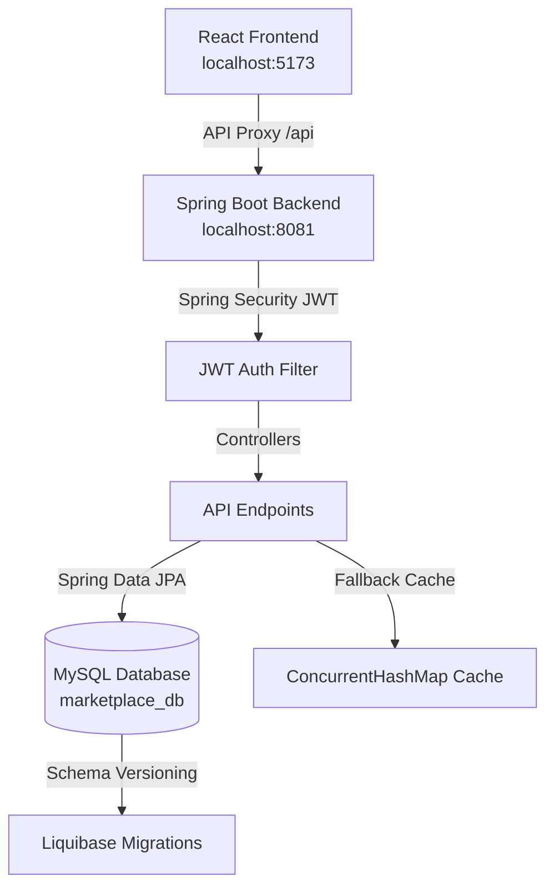

# Multi-Vendor E-Commerce Marketplace

A robust, premium, and feature-rich full-stack multi-vendor e-commerce platform. This project provides a complete end-to-end shopping experience featuring secure role-based access controls for **Buyers**, **Sellers**, and **Admins**. 

Built with a modern tech stack consisting of **Spring Boot 3.2.x**, **React 18 (TypeScript & Vite)**, and **MySQL**, the application showcases enterprise-grade patterns such as database versioning with Liquibase, state management, secure JWT authentication, and structured API proxies.

---

## 🚀 System Architecture

The project is structured as a decoupled monorepo containing a Java/Spring Boot backend and a React/TypeScript SPA frontend:



---

## 🛠️ Technology Stack

| Layer | Technologies Used |
| :--- | :--- |
| **Frontend** | React 18, Vite, TypeScript, Vanilla CSS (Premium Dark/Glassmorphism theme), Lucide Icons, Axios, React Router Dom |
| **Backend** | Java 21, Spring Boot 3.2.x, Spring Security (JWT), Spring Data JPA, Hibernate, MapStruct, Lombok, Java Mail Sender |
| **Database** | MySQL 8.x, Liquibase (Database migration & seeding) |
| **Caching** | Redis (Optional integration / concurrent fallback cache) |

---

## 🌟 Key Features

### 🔑 Security & Authentication
- **JWT-Based Security**: Fully stateless JSON Web Tokens for authentication.
- **Role-Based Routing**: Strict route protection on both frontend and backend for **BUYER**, **SELLER**, and **ADMIN** roles.
- **Password Hashing**: Strong BCrypt password encoding for secure credential storage.

### 🛒 Buyer Experience
- **Interactive Home Page**: Promos, product category sliders, and trending product feeds.
- **Product Discovery**: Advanced product filtering by categories, search keywords, and price ranges.
- **Product Details & Reviews**: Deep-dive views with rich images, specifications, and buyer reviews.
- **Shopping Cart**: Real-time cart updates (add/remove items, update quantities) with dynamic subtotal calculations.
- **Checkout & Orders**: Secure order creation with shipping/billing address input and direct order tracking.

### 🏪 Seller Hub
- **Seller Onboarding**: Dedicated signup workflow to create a Seller Profile and store details.
- **Inventory Management**: Easy-to-use form for adding new products with descriptions, pricing, inventory stock counts, and image uploads.
- **Order Fulfilment**: Dedicated interface to view and manage customer orders, update shipping progress, and track earnings.
- **Seller Dashboard**: Visual summary of active products, revenue, and order status.

### 🛡️ Admin Portal
- **User Administration**: Infrastructure ready for approving pending sellers, auditing reviews, and managing user roles.

---

## 🗄️ Database Schema & Versioning

The database is version-controlled using **Liquibase** migrations. When the Spring Boot application boots up, it automatically applies versioned SQL scripts located in `src/main/resources/db/changelog/migrations`:

1. `V1__init_schema.sql`: Establishes the database schema including `users`, `seller_profiles`, `categories`, `products`, `product_images`, `carts`, `orders`, `order_items`, and `reviews`.
2. `V2__seed_categories.sql`: Seeds default market categories (Electronics, Fashion, Home & Kitchen, Books, Sports & Outdoors).
3. `V3__seed_admin.sql`: Seeds a default system administrator account.

---

## 🏁 Getting Started

### 📋 Prerequisites
Ensure you have the following installed locally:
- **Java Development Kit (JDK) 21**
- **Node.js (v18+) & npm**
- **MySQL Server 8.x** running locally on port `3306`

---

### 💻 Step 1: Database Setup
1. Create a MySQL database named `marketplace_db`:
   ```sql
   CREATE DATABASE marketplace_db;
   ```
2. Open `marketplace-backend/src/main/resources/application.yml` and verify the datasource properties:
   ```yaml
   spring:
     datasource:
       url: jdbc:mysql://localhost:3306/marketplace_db?createDatabaseIfNotExist=true&useSSL=false&allowMultiQueries=true
       username: root
       password: Prajwal123  # Update with your MySQL password
   ```

---

### ☕ Step 2: Run the Spring Boot Backend
1. Navigate into the backend directory:
   ```bash
   cd marketplace-backend
   ```
2. Build and run the backend using Maven:
   ```bash
   mvn clean spring-boot:run
   ```
   *The backend will boot up on **http://localhost:8081** (specifically configured to avoid conflicts with port 8080).*

---

### ⚛️ Step 3: Run the React Frontend
1. Navigate into the frontend directory:
   ```bash
   cd marketplace-frontend
   ```
2. Install dependencies:
   ```bash
   npm install
   ```
3. Start the Vite development server:
   ```bash
   npm run dev
   ```
   *The frontend will run on **http://localhost:5173** and proxy API requests automatically to `http://localhost:8081`.*

---

## 🧪 Demo Credentials

To test the system immediately, you can log in with the following default seeded administrator profile, or sign up as a new **Buyer** or **Seller** via the register screen:

* **Administrator Email**: `admin@marketplace.com`
* **Administrator Password**: `Admin@123`

---

## 📂 Project Structure

```text
java project 1/
│
├── marketplace-backend/         # Spring Boot 3 API Server
│   ├── src/main/java/           # Java Sources (Controllers, Services, Security)
│   ├── src/main/resources/      # Liquibase changelogs, application configurations
│   └── pom.xml                  # Maven Dependencies
│
├── marketplace-frontend/        # React + TypeScript Web App
│   ├── src/                     # React App (Pages, Components, Redux Store)
│   ├── vite.config.ts           # Vite Build & Proxy Configuration
│   └── package.json             # NPM dependencies & scripts
│
└── docker-compose.yml           # Local containerized infrastructure (MySQL, Redis)
```
